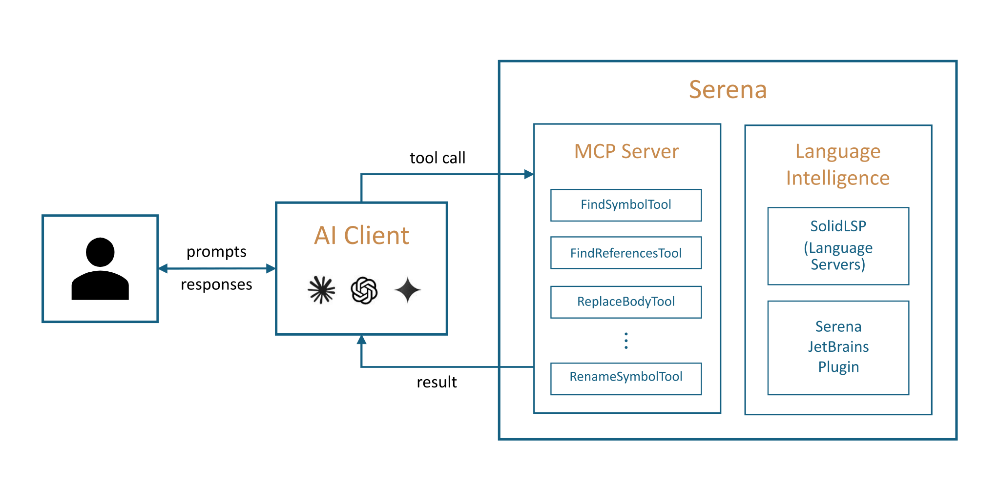

<p align="center" style="text-align:center;">
  
  
</p>

<h3 align="center">
    Serena is the IDE for your coding agent.
</h3>

<div align="center">
  <a href="https://discord.com/invite/cVUNQmnV4r"></a>
  <a href="https://github.com/oraios/serena/main/LICENSE"></a>
</div>
<br>


* Serena provides essential **semantic code retrieval, editing, refactoring and debugging tools** that are akin to an IDE's capabilities,
  operating at the symbol level and exploiting relational structure.
* It integrates with any client/LLM via the model context protocol (**MCP**).
  
Serena's **agent-first tool design** involves robust high-level abstractions, distinguishing it from
approaches that rely on low-level concepts like line numbers or primitive search patterns.

Practically, this means that your agent operates **faster, more efficiently and more reliably**, especially in larger and
more complex codebases.

> [!IMPORTANT]
> Do not install Serena via an MCP or plugin marketplace! They contain outdated and suboptimal installation commands. 
> Instead, follow our [Quick Start](#quick-start) instructions.

## Quick Demo

https://github.com/user-attachments/assets/8d11646e-b80e-4723-b9d7-32d6101b5f58

:tv: Longer video: [Introduction to Serena in 5 Minutes (YouTube)](https://www.youtube.com/watch?v=5QN7gN1KYLA)

## What Our "End Users" Say

While it is humans who download and set up Serena, our end users are essentially AI agents.
As the ones actually applying Serena's tools, they are in the best position to evaluate Serena.

We crafted an unbiased evaluation prompt that leads the agent to perform ~20 routine coding tasks, 
representative of everyday development work, 
in order to estimate the value added by Serena's tools when used alongside its own built-ins. 

Here's a one-sentence summary of what the agents had to say:

**Opus 4.6 (high) in Claude Code on a large Python codebase:**
> "Serena's IDE-backed semantic tools are the single most impactful addition to my toolkit – cross-file renames, moves, and reference lookups that
would cost me 8–12 careful, error-prone steps collapse into one atomic call, and I would absolutely ask any developer I work with to set them up."

**GPT 5.4 (high) in Codex CLI on a Java codebase:**
> "As a coding AI agent, I would ask my owner to add Serena because it gives me the missing IDE-level understanding of symbols, references, and
refactorings, turning fragile text surgery into calmer, faster, more confident code changes where semantics matter."

**GPT 5.4 (medium) in Copilot CLI on a large, multi-language monorepo:**
> "As a coding agent, I’d absolutely ask my owner to add Serena because it makes me noticeably sharper and calmer on
real code – especially symbol-aware navigation, cross-file refactors, and monorepo dependency jumps – while I still lean
on built-ins for tiny text edits and non-code work."

Different agents in different settings independently converge on the same verdict.

_Give your agent the tools it has been asking for and add Serena MCP to your client!_

See our [documentation](https://oraios.github.io/serena/04-evaluation/000_evaluation-intro.html) for the full methodology and much more detailed evaluation results, or run your own evaluation on a project of your choice.
 

## How Serena Works

Serena provides the necessary [tools](https://oraios.github.io/serena/01-about/035_tools.html) for coding workflows, 
but an LLM is required to do the actual work, orchestrating tool use.

Serena can extend the functionality of your existing AI client via the **model context protocol (MCP)**.
Most modern AI chat clients directly support MCP, including
* terminal-based clients like Claude Code, Codex, OpenCode, or Gemini-CLI,
* IDEs and IDE assistant plugins for VSCode, Cursor and JetBrains IDEs (Copilot, Junie, JetBrains AI Assistant, etc.),
* desktop and web clients like Claude Desktop, Codex App, or OpenWebUI.



:tv: See also: [Introduction to Serena in 5 Minutes (YouTube)](https://www.youtube.com/watch?v=5QN7gN1KYLA)

To connect the Serena MCP server to your client, you either
  * provide the client with a launch command that allows it to start the MCP server, or
  * start the Serena MCP server yourself in HTTP mode and provide the client with the URL.

See the [Quick Start](#quick-start) section below for information on how to get started.

## Programming Language Support & Semantic Analysis Capabilities

Serena provides a set of versatile code querying and editing functionalities
based on symbolic understanding of the code.
Equipped with these capabilities, your agent discovers and edits code just like a seasoned developer
making use of an IDE's capabilities would.
Serena can efficiently find the right context and do the right thing even in very large and
complex projects!

There are two alternative technologies powering these capabilities:

* **Language servers** implementing the language server protocol (LSP) — the free/open-source alternative 
  which is used by default.
* **The Serena JetBrains Plugin**, which leverages the powerful code analysis and editing
  capabilities of your JetBrains IDE (paid plugin; free trial available).

You can choose either of these backends depending on your preferences and requirements.

### Language Servers

Serena incorporates a powerful abstraction layer for the integration of language servers that implement the language server protocol (LSP). 
The underlying language servers are typically open-source projects or at least freely available for use.

When using Serena's language server backend, we provide **support for over 40 programming languages**, including
AL, Ansible, Bash, C#, C/C++, Clojure, Crystal, Dart, Elixir, Elm, Erlang, Fortran, F#, GLSL, Go, Groovy, Haskell, Haxe, HLSL, Java, JavaScript, JSON, Julia, Kotlin, Lean 4, Lua, Luau, Markdown, MATLAB, mSL, Nix, OCaml, Perl, PHP, PowerShell, Python, R, Ruby, Rust, Scala, Solidity, Swift, TOML, TypeScript, WGSL, YAML, and Zig.

### The Serena JetBrains Plugin

The paid Serena JetBrains Plugin (free trial available)
leverages the powerful code analysis capabilities of your JetBrains IDE.
The plugin naturally supports all programming languages and frameworks that are supported by JetBrains IDEs,
including IntelliJ IDEA, PyCharm, Android Studio, WebStorm, PhpStorm, RubyMine, GoLand, and potentially others (Rider and CLion are unsupported though).

<a href="https://plugins.jetbrains.com/plugin/28946-serena/"></a>

See our [documentation page](https://oraios.github.io/serena/02-usage/025_jetbrains_plugin.html) for further details and instructions on how to apply the plugin.

## Features

Serena provides a wide range of tools for efficient code retrieval, editing and refactoring, as well as 
a memory system for long-lived agent workflows.

Given its large scope, Serena adapts to your needs by offering a multi-layered configuration system.

<details>
<summary>Details</summary>

### Retrieval

Serena's retrieval tools allow agents to explore codebases at the symbol level, understanding structure and relationships
without reading entire files.

| Capability                       | Language Servers | JetBrains Plugin |
|----------------------------------|------------------|------------------|
| find symbol                      | yes              | yes              |
| symbol overview (file outline)   | yes              | yes              |
| find referencing symbols         | yes              | yes              |
| search in project dependencies   | --               | yes              |
| type hierarchy                   | --               | yes              |
| find declaration                 | --               | yes              |
| find implementations             | --               | yes              |
| query external projects          | yes              | yes              |

### Refactoring

Without precise refactoring tools, agents are forced to resort to unreliable and expensive search and replace operations.

| Capability                                | Language Servers   | JetBrains Plugin                  |
|-------------------------------------------|--------------------|-----------------------------------|
| rename                                    | yes (only symbols) | yes (symbols, files, directories) |
| move (symbol, file, directory)            | --                 | yes                               |
| inline                                    | --                 | yes                               |
| propagate deletions (remove unused code)  | --                 | yes                               |

### Symbolic Editing

Serena's symbolic editing tools are less error-prone and much more token-efficient than typical alternatives.

| Capability             | Language Servers  | JetBrains Plugin |
|------------------------|-------------------|------------------|
| replace symbol body    | yes               | yes              |
| insert after symbol    | yes               | yes              |
| insert before symbol   | yes               | yes              |
| safe delete            | yes               | yes              |

### Interactive Debugging

Exclusive to the JetBrains plugin, Serena supports a highly general debugging tool,
which allows an agent to set breakpoints, inspect variables, evaluate expressions and control execution flow 
via a persistent REPL-style interface.

### Basic Features

Beyond its semantic capabilities, Serena includes a set of basic utilities for completeness.
When Serena is used inside an agentic harness such as Claude Code or Codex, these tools are typically disabled by default,
since the surrounding harness already provides overlapping file, search, and shell capabilities.

- **`search_for_pattern`** – flexible regex search across the codebase 
- **`replace_content`** – agent-optimised regex-based and literal text replacement
- **`list_dir` / `find_file`** – directory listing and file search
- **`read_file`** – read files or file chunks
- **`execute_shell_command`** – run shell commands (e.g. builds, tests, linters)

### Memory Management

A memory system is elemental to long-lived agent workflows, especially when knowledge is to be shared across
sessions, users and projects.
Despite its simplicity, we received positive feedback from many users who tend to combine Serena's memory management system with their
agent's internal system (e.g., `AGENTS.md` files).
It can easily be disabled if you prefer to use something else.

### Configurability

Active tools, tool descriptions, prompts, language backend details and many other aspects of Serena
can be flexibly configured on a per-case basis by simply adjusting a few lines of YAML.
To achieve this, Serena offers multiple levels of (composable) configuration:

* global configuration
* MCP launch command (CLI) configuration
* per-project configuration (with local overrides)
* execution context-specific configuration (e.g. for particular clients)
* dynamically composable configuration fragments (modes)

</details>

## Quick Start

**Prerequisites**. Serena is managed by *uv*, and [installing uv](https://docs.astral.sh/uv/getting-started/installation/) is the only required prerequisite.

> [!NOTE]
> When using the language server backend, some additional dependencies may need to be installed to support certain languages;
> see the [Language Support](https://oraios.github.io/serena/01-about/020_programming-languages.html) page for details.

**Install Serena**. Serena is installed via uv as follows:

```bash
uv tool install -p 3.13 serena-agent@latest --prerelease=allow
```

After successful installation, the command `serena` should be available in your shell.

**Initialise Serena**. To initialise Serena and verify that your setup works correctly, simply run:

```bash
serena init
```

By default, this will set up Serena to use the language server backend. To use the JetBrains backend instead, add the parameters `-b JetBrains` 
(see the [JetBrains Plugin documentation page](https://oraios.github.io/serena/02-usage/025_jetbrains_plugin.html) for additional usage details).  
Either way, you should receive a success message indicating that Serena has been initialised successfully.

**Configuring Your Client**. To connect Serena to your preferred MCP client, you typically need to [configure a launch command in your client](https://oraios.github.io/serena/02-usage/030_clients.html).
Follow the link for specific instructions on how to set up Serena for Claude Code, Codex, Claude Desktop, MCP-enabled IDEs and other clients (such as local and web-based GUIs). 

> [!TIP]
> While getting started quickly is easy, Serena is a powerful toolkit with many configuration options.
> We highly recommend reading through the [user guide](https://oraios.github.io/serena/02-usage/000_intro.html) to get the most out of Serena.
> 
> Specifically, we recommend to read about ...
>   * [Serena's project-based workflow](https://oraios.github.io/serena/02-usage/040_workflow.html) and
>   * [configuring Serena](https://oraios.github.io/serena/02-usage/050_configuration.html).

## User Guide

Please refer to the [user guide](https://oraios.github.io/serena/02-usage/000_intro.html) for detailed instructions on how to use Serena effectively.

## Acknowledgements

A significant part of Serena, especially support for various languages, was contributed by the open source community.
We are very grateful for the many contributors who made this possible and who played an important role in making Serena
what it is today.
